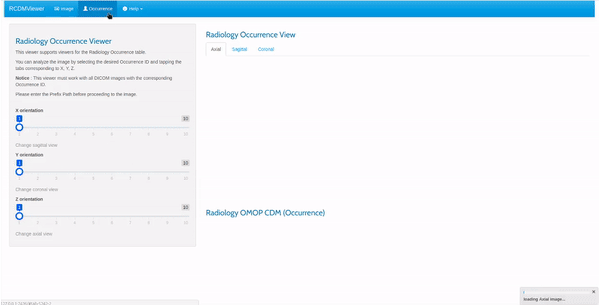
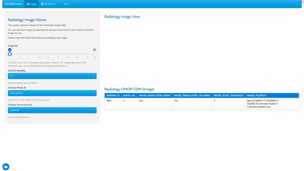
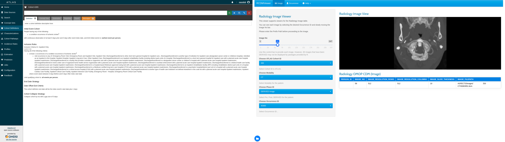

<h1 align="center">Welcome to RCDMViewer 👋</h1>
<p>
  
  <a href="https://github.com/NEONKID/RCDMViewer">
    
  </a>
</p>

> This application is an example application of Radiology CDM.


<br />


## ✨ Overview

If the original radiological image was a DICOM Viewer, this viewer is a viewer based on the Radiology CDM. The role of seeing radiological images is the same, but based on the OMOP CDM, rather than collecting a lot of metadata in DICOM, we developed only reference to common data of radiological images.

See this link for more information on [RCDM](https://github.com/OHDSI/Radiology-CDM)

<br />


## ⚛ Preview

### Occurrence View


### Image View


### Cohort View



<br />


## ⏳ Install

```bash
$ git clone https://github.com/NEONKID/RCDMViewer.git
```

If Clone is finished, create RDBMS connection information with RCDM in the configuration file named RCDMViewer.cfg. ***If you do not create this file, you will not be able to use the application.***


```bash
$ Rscript -e packageManager.R
```

Be sure to install the package via the above command. The package described in this code is the package needed to use RCDMViewer. Depending on the device, it may take more than 10 minutes.


<br />


## 🚀 Usage 

RCDMViewer requires a database containing the Radiology CDM. If you have completed the ETL process, you should configure where this database resides.

```bash
$ nano RCDMviewer.cfg
```

Setup the CDM database from the above file. If you are using ATLAS Cohort, you must also add the result database and dictionary database.

```bash
$ nano ATLAS_DB.cfg
```

Please set the database of ATLAS to import the Cohort defined by ATLAS.


### Host

```bash
$ vim ${SHINY_PATH}/shiny-server.conf
```

If you want to deploy this application to a host, use Shiny Server.


### Docker

```bash
$ docker build --tag rcdmviewer:latest
```

You can also use Docker images.

```bash
$ docker-compose up
```

Use docker-compose for multi-server configuration.


<br />

## Author

👤 **Kwang Soo Jeong**

* Github: [@NEONKID](https://github.com/NEONKID)


<br />


## 🤝 Contributing

Contributions, issues and feature requests are welcome!<br />Feel free to check [issues page](https://github.com/NEONKID/RCDMViewer/issues).


<br />


## Show your support

Give a ⭐️ if this project helped you!

***
_This README was generated with ❤️ by [readme-md-generator](https://github.com/kefranabg/readme-md-generator)_